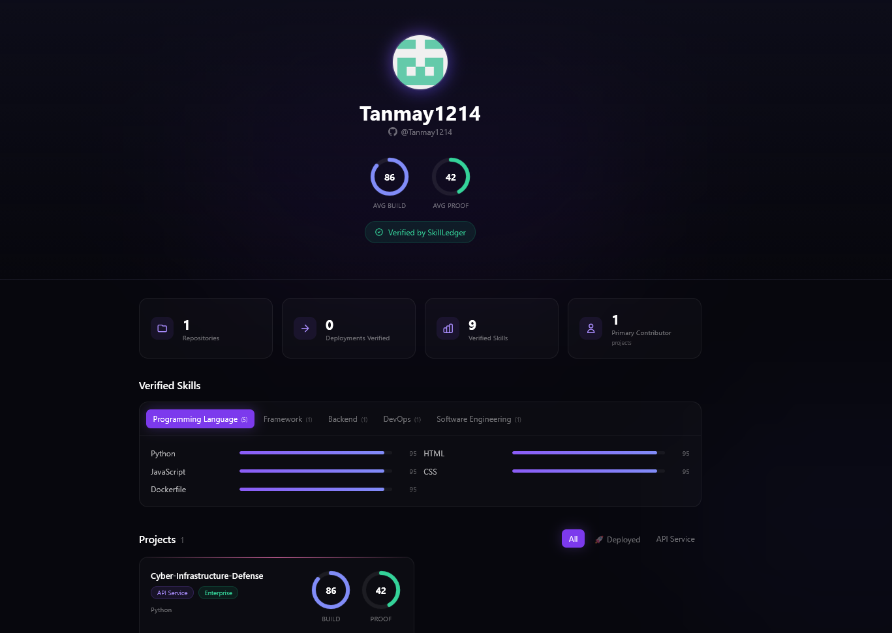
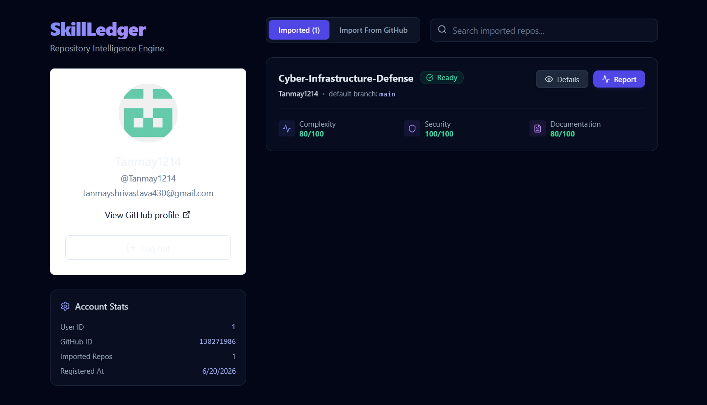
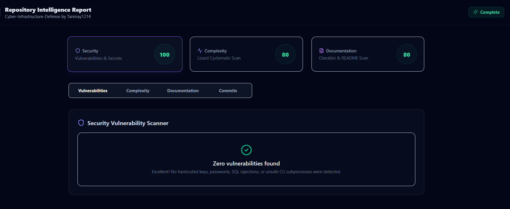
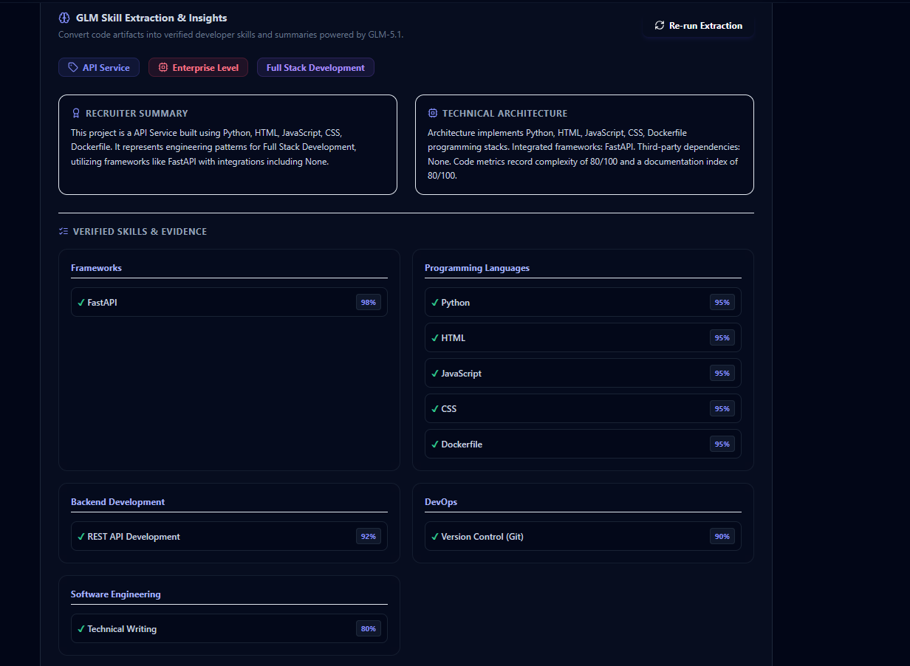
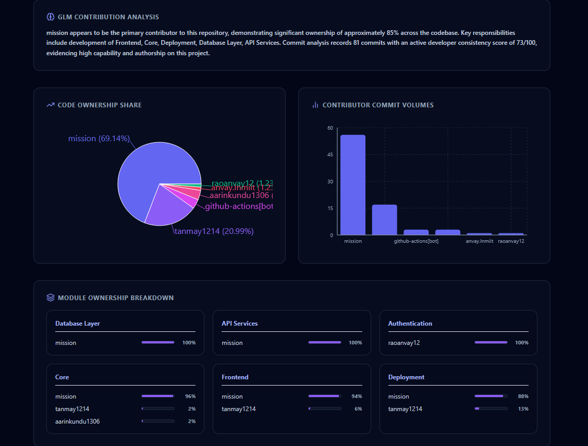
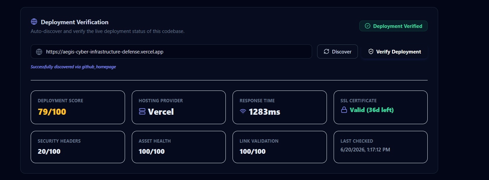

<div align="center">
  <h1>🔐 SkillLedger</h1>
  <p><strong>Verify what you built. Prove what you know.</strong></p>
  <p>An AI-powered developer portfolio platform that transforms your GitHub repositories into verified, evidence-backed proof of your skills — for recruiters who care about real work.</p>

  <p>
    
    
    
    
    
    
  </p>
</div>

---

## 📸 Screenshots

> _Drop your screenshots into `docs/screenshots/` to make these appear!_

| Portfolio Page | Dashboard | Repository Analysis |
|---|---|---|
|  |  |  |

| Skills Panel | Contribution Verification | Deployment Verification |
|---|---|---|
|  |  |  |

---

## 🚀 What is SkillLedger?

SkillLedger is a full-stack portfolio intelligence platform. Connect your GitHub account, import repositories, and the system automatically:

1. **Analyzes** your code for complexity, security, and documentation quality
2. **Extracts verified skills** using GLM-4 AI — with confidence scores and real evidence
3. **Verifies deployments** — live URL scanning, SSL, security headers, asset health
4. **Quantifies your contribution** — commit history, file ownership, module authorship
5. **Generates a public portfolio** at `/u/{username}` with scores, skill charts, and project cards

No self-reporting. No fluff. Just proof.

---

## 🏗️ Architecture

```
SkillLedger
├── backend/                  # FastAPI + Python 3.11
│   ├── app/
│   │   ├── api/              # Route handlers (auth, repos, skills, contributions, portfolio)
│   │   ├── services/         # Business logic & AI integrations
│   │   ├── models/           # SQLAlchemy ORM models
│   │   ├── schemas/          # Pydantic request/response schemas
│   │   ├── database/         # Session management, Base, migrations
│   │   └── core/             # Config, security utils
│   ├── alembic/              # Database migrations
│   └── tests/
│
└── frontend/                 # Next.js 15 + TypeScript + Tailwind CSS
    └── src/
        ├── app/
        │   ├── dashboard/    # Authenticated dashboard
        │   ├── repositories/ # Repository detail & analysis views
        │   └── u/[username]/ # 🌍 Public portfolio page
        ├── components/
        │   ├── auth/
        │   ├── portfolio/    # PortfolioView, score rings, skill bars
        │   └── ui/           # shadcn/ui components
        ├── lib/              # API client, config
        └── types/            # TypeScript interfaces
```

---

## ✨ Feature Modules

### 1. 🔐 GitHub OAuth Authentication
- Secure GitHub OAuth 2.0 login flow
- HTTP-only cookie session management (access + refresh JWT)
- Auto token refresh middleware

### 2. 📦 Repository Import System
- Browse all your GitHub repositories
- One-click import with full metadata sync (stars, forks, languages, frameworks)
- Background repository cloning and analysis queue

### 3. 🧠 Repository Intelligence Engine
- Code complexity scoring (0–100)
- Security vulnerability scanning
- Documentation coverage analysis
- Commit history aggregation

### 4. 🤖 GLM Skill Extraction Service (AI)
- Powered by **Zhipu AI GLM-4 Flash**
- Extracts verified skills with confidence scores (0–100) from real code evidence
- Categories: Language, Framework, Database, DevOps, AI/ML, Security
- Generates recruiter-friendly project summaries and insights

### 5. 🌐 Deployment Verification Engine
- Auto-discovers live deployment URLs (Vercel, Netlify, Railway, custom)
- Checks reachability, SSL certificate, security headers
- Asset health scoring and internal link validation
- Deployment Score (0–100)

### 6. 👥 Contribution Verification Engine
- Per-contributor commit analysis (additions, deletions, ownership %)
- Module-level file ownership mapping
- Activity score computation
- Evidence-backed contribution reports

### 7. 📊 Dynamic Portfolio Generator
- Public portfolio at `/u/{username}` — fully automated, zero manual editing
- **Build Score** = `0.4 × Complexity + 0.3 × Security + 0.3 × Documentation`
- **Proof Score** = `0.5 × Deployment Score + 0.5 × Contribution %`
- Animated SVG score rings and skill confidence bars
- Filter projects by type, deployment status, and tech stack
- Instant loading skeleton + SEO-ready metadata

---

## 📡 API Reference

All endpoints are prefixed with `/api/v1`.

### Auth
| Method | Endpoint | Description |
|--------|----------|-------------|
| `GET` | `/auth/github/login` | Get GitHub OAuth URL |
| `GET` | `/auth/github/callback` | OAuth callback handler |
| `GET` | `/auth/me` | Get current user |
| `POST` | `/auth/logout` | Logout and clear cookies |
| `POST` | `/auth/refresh` | Rotate token pair |

### Repositories
| Method | Endpoint | Description |
|--------|----------|-------------|
| `GET` | `/repositories/github` | List GitHub repos |
| `POST` | `/repositories/import` | Import a repository |
| `GET` | `/repositories` | List imported repos |
| `GET` | `/repositories/{id}` | Get repo details |
| `GET` | `/repositories/{id}/analysis` | Get analysis report |

### Skills & Insights
| Method | Endpoint | Description |
|--------|----------|-------------|
| `POST` | `/skills/extract/{repo_id}` | Run GLM skill extraction |
| `GET` | `/skills/{repo_id}` | Get extracted skills |
| `GET` | `/insights/{repo_id}` | Get recruiter insights |

### Deployments
| Method | Endpoint | Description |
|--------|----------|-------------|
| `POST` | `/deployments/discover/{repo_id}` | Auto-discover deployment URL |
| `POST` | `/deployments/verify/{repo_id}` | Run deployment scan |
| `GET` | `/deployments/report/{repo_id}` | Get latest deployment report |

### Contributions
| Method | Endpoint | Description |
|--------|----------|-------------|
| `POST` | `/contributions/analyze/{repo_id}` | Run contribution analysis |
| `GET` | `/contributions/{repo_id}` | Get contribution report |
| `GET` | `/contributions/{repo_id}/contributors` | List all contributors |
| `GET` | `/contributions/{repo_id}/ownership` | Module ownership breakdown |

### Portfolio (Public)
| Method | Endpoint | Description |
|--------|----------|-------------|
| `GET` | `/portfolio/{username}` | Full portfolio aggregation |
| `GET` | `/portfolio/{username}/projects` | Projects list |
| `GET` | `/portfolio/{username}/skills` | Grouped skill categories |

---

## 🗄️ Database Schema

```
users ──────────────────── repositories
                               │
           ┌───────────────────┼──────────────────────┐
           │                   │                      │
  repository_analyses     contributors         deployment_reports
  (complexity, security,  (commits, ownership  (url, ssl, score,
   documentation scores)   %, activity score)   headers, provider)
           │
  ┌────────┼──────────────────────┐
  │        │                      │
skills  project_insights  contribution_reports  module_ownerships
```

---

## 🛠️ Local Development Setup

### Prerequisites
- Python 3.11+
- Node.js 18+
- Git

### 1. Clone the repository

```bash
git clone https://github.com/Tanmay1214/SkillLedger.git
cd SkillLedger
```

### 2. Backend Setup

```bash
cd backend

# Create virtual environment
python -m venv .venv
.venv\Scripts\activate        # Windows
# source .venv/bin/activate   # macOS/Linux

# Install dependencies
pip install -r requirements.txt

# Configure environment
cp .env.example .env
# Edit .env — add your GitHub OAuth credentials and GLM API key

# Run database migrations
alembic upgrade head

# Start the backend
uvicorn app.main:app --reload --port 8000
```

### 3. Frontend Setup

```bash
cd frontend

# Install dependencies
npm install

# Configure environment (optional — defaults to localhost:8000)
cp .env.example .env.local

# Start the dev server
npm run dev
```

### 4. Open in browser

| URL | Description |
|-----|-------------|
| `http://localhost:3000` | Main app |
| `http://localhost:8000/docs` | Interactive API docs |
| `http://localhost:3000/u/{username}` | Your public portfolio |

---

## 🔑 Environment Variables

Copy `.env.example` to `.env` and fill in your values.

| Variable | Required | Description |
|---|---|---|
| `DATABASE_URL` | ✅ | SQLite or PostgreSQL connection string |
| `GITHUB_CLIENT_ID` | ✅ | From GitHub OAuth App settings |
| `GITHUB_CLIENT_SECRET` | ✅ | From GitHub OAuth App settings |
| `JWT_SECRET` | ✅ | Random secret (`openssl rand -hex 32`) |
| `GLM_API_KEY` | ✅ | From [Zhipu AI](https://open.bigmodel.cn/) |
| `GEMINI_API_KEY` | ❌ | Optional — reserved for future use |
| `FRONTEND_URL` | ✅ | `http://localhost:3000` in development |
| `CORS_ORIGINS` | ✅ | Comma-separated allowed origins |

### Setting up GitHub OAuth
1. Go to [GitHub Developer Settings](https://github.com/settings/developers)
2. Click **New OAuth App**
3. Homepage URL: `http://localhost:3000`
4. Callback URL: `http://localhost:8000/api/v1/auth/github/callback`
5. Copy **Client ID** and **Client Secret** into your `.env`

### Getting a GLM API Key
1. Register at [Zhipu AI Open Platform](https://open.bigmodel.cn/)
2. Go to **API Keys** in your dashboard
3. Create a new key and set it as `GLM_API_KEY`

---

## 🐳 Docker Compose

```bash
# Start all services (backend + frontend + postgres)
docker-compose up -d

# Run migrations
docker-compose exec backend alembic upgrade head
```

---

## 🧪 Tests

```bash
# Backend tests
cd backend
pytest tests/ -v

# Frontend type check
cd frontend
npx tsc --noEmit

# Frontend build
npm run build
```

---

## 🗺️ Roadmap

- [ ] Shareable portfolio cards with OG image generation
- [ ] PDF export of portfolio
- [ ] Recruiter view — compare candidates side-by-side
- [ ] Webhook-based auto-refresh on new pushes
- [ ] Email verification of GitHub identity

---

## 🤝 Contributing

Pull requests are welcome! For major changes, please open an issue first.

```bash
git checkout -b feat/your-feature
# make changes
git push origin feat/your-feature
# open a PR on GitHub
```

---

## 📄 License

MIT © [Tanmay](https://github.com/Tanmay1214)

---

<div align="center">
  <p>Built with ❤️ using FastAPI, Next.js, and GLM-4 AI</p>
  <p>
    <a href="https://github.com/Tanmay1214/SkillLedger">⭐ Star this repo</a>
    ·
    <a href="https://github.com/Tanmay1214/SkillLedger/issues">🐛 Report Bug</a>
    ·
    <a href="https://github.com/Tanmay1214/SkillLedger/issues">✨ Request Feature</a>
  </p>
</div>
